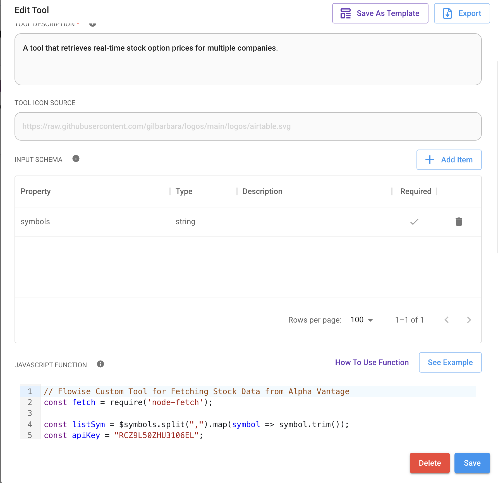
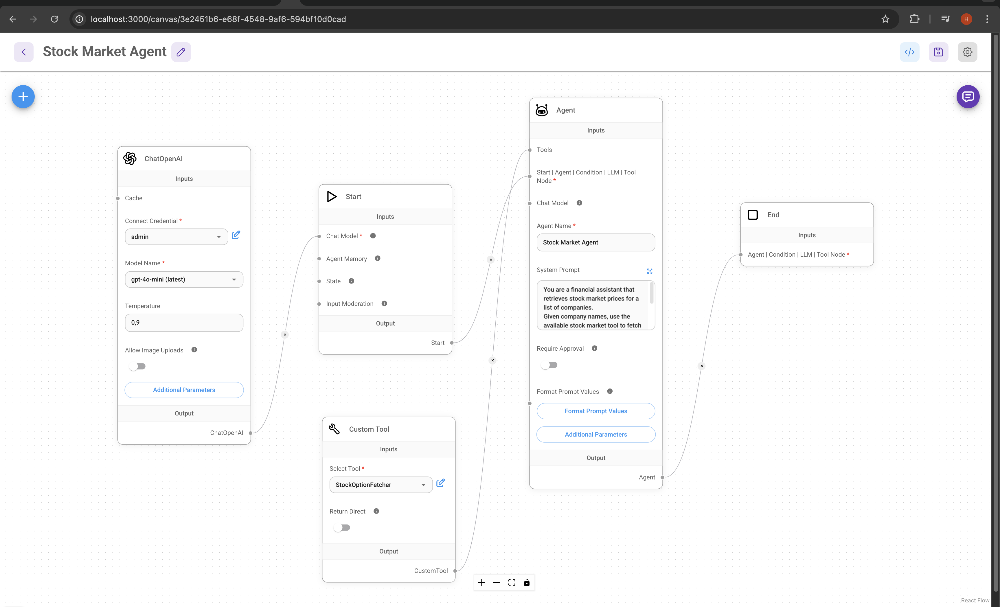
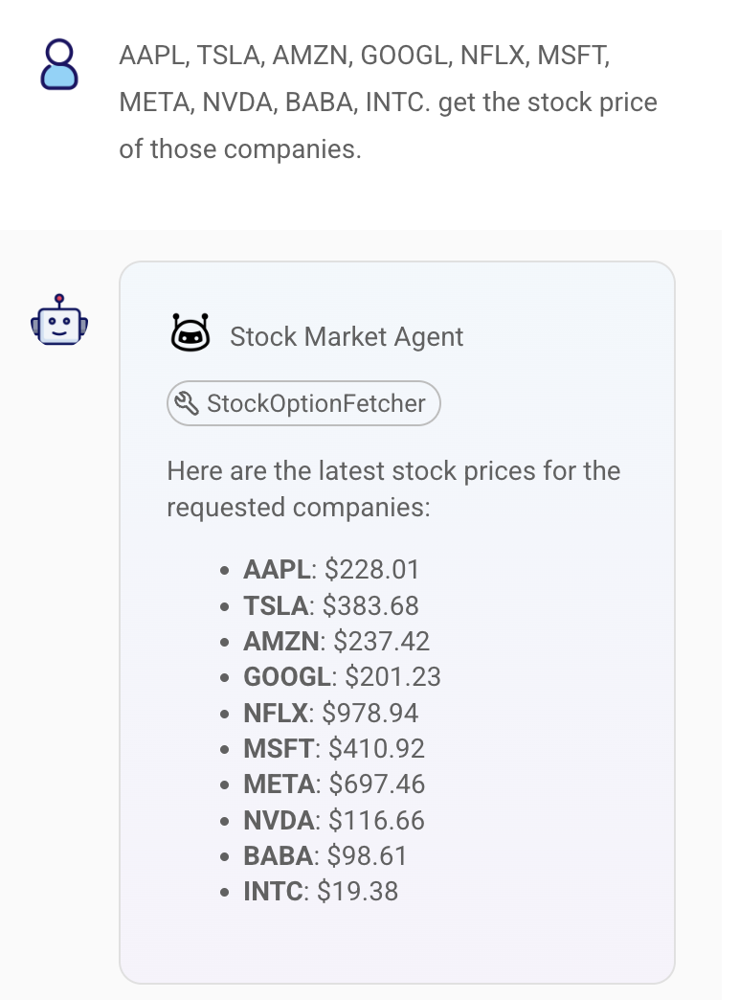
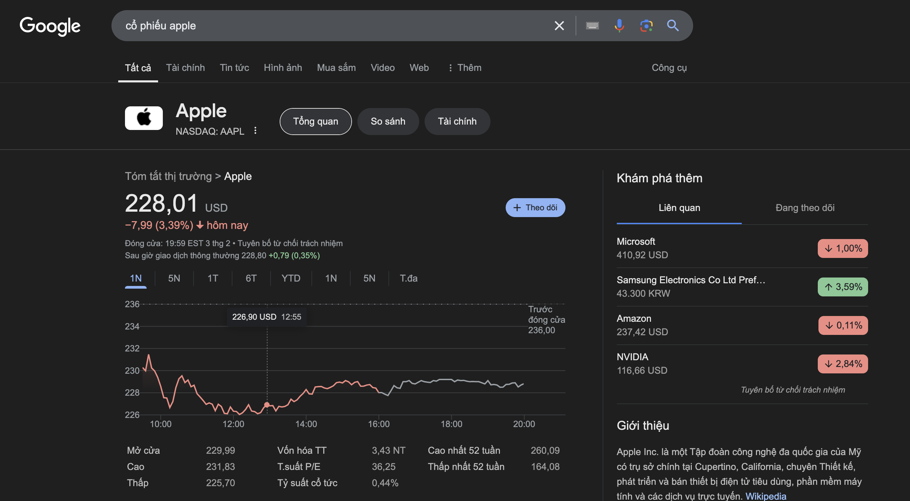

# Stock Option Fetcher - Flowise Custom Tool


This project is a Custom Tool in Flowise that fetches real-time stock prices for multiple companies using the Alpha Vantage API. The tool is built as part of the MincaAI technical test to evaluate API integration and Flowise customization skills.

## 1️⃣ Setting up Flowise locally

Install the Flowise by command
```text
npm install -g flowise
```

Install the Flowise by command
```text
flowise start
```
Once started, Flowise should be accessible at http://localhost:3000.

Then setup the credentials for the Custom Tool.



FInally, setting up the chatflow for the Agent.




## 2️⃣ Testing the Agent

In the chat section, enter a list of some companies and then return the stock values of each companies.



We compare with the real data from other information sources like Google to evaluate the AI model. 



## 3️⃣ Code explaination

### 1. Fetch Data from Alpha Vantage API

API key and baseURL
```js
const apiKey = "RCZ9L50ZHU3106EL";
const baseUrl = "https://www.alphavantage.co/query";
```

Fetches the data using await fetch(url).
Converts the response to JSON format.

```js
const url = `${baseUrl}?function=GLOBAL_QUOTE&symbol=${symbol}&apikey=${apiKey}`;
const response = await fetch(url);
const data = await response.json();
```


### 2. Return the Final Result

Returns an array of stock prices in the example format:
```json
{
  "stocks": [
    { "symbol": "AAPL", "price": "150.25" },
    { "symbol": "MSFT", "price": "312.50" },
    { "symbol": "GOOGL", "error": "Data not available" }
  ]
}
```
For the company that do not updated the data, response will be "Data not available"

### 3. System Error handler
In some special case, it catches any unexpected errors (e.g., network failures) and returns a general error message.
```js
} catch (error) {
    return { error: "Failed to fetch stock data", details: error.message };
}
```
